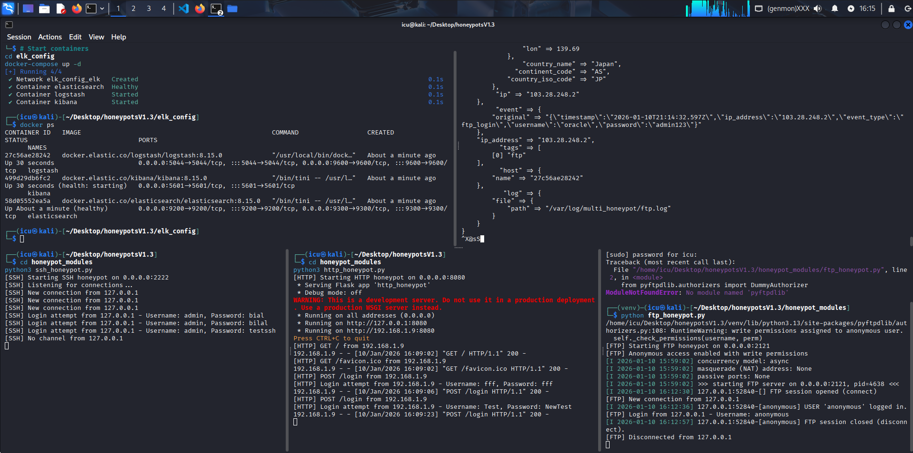
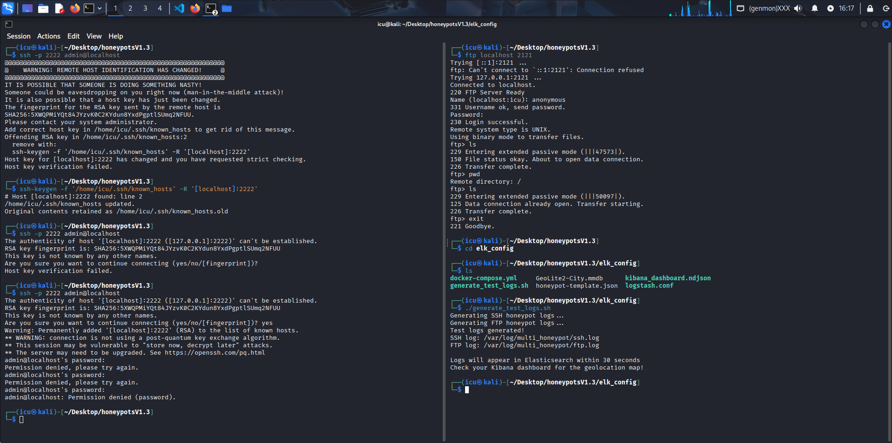
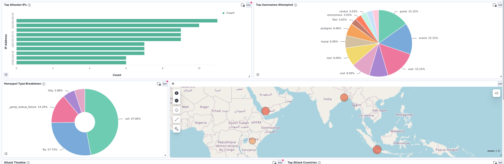
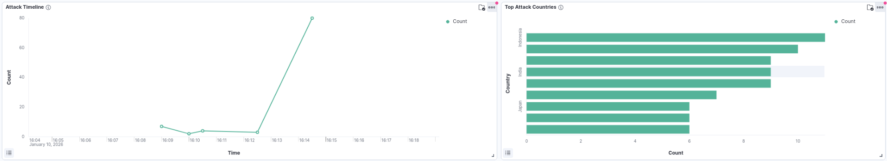

<div align="center">

# 🍯 Multi-Honeypot Platform

### A Comprehensive Security Monitoring System with ELK Stack Integration

[](https://python.org)
[](https://docker.com)
[](https://elastic.co)
[](https://elastic.co)
[](LICENSE)

**Detect • Capture • Analyze • Visualize**

[Features](#-features) • [Screenshots](#-screenshots) • [Quick Start](#-quick-start) • [Architecture](#-architecture) • [Documentation](#-documentation)

</div>

---

## 📋 Table of Contents

- [Overview](#-overview)
- [Features](#-features)
- [Screenshots](#-screenshots)
- [Architecture](#-architecture)
- [Tech Stack](#-tech-stack)
- [Quick Start](#-quick-start)
- [Testing](#-testing)
- [Troubleshooting](#-troubleshooting)
- [Project Structure](#-project-structure)
- [Port Reference](#-port-reference)
- [Log Format](#-log-format)
- [System Requirements](#-system-requirements)
- [Contributing](#-contributing)
- [License](#-license)

---

## 🎯 Overview

**Multi-Honeypot Platform** is a production-ready security monitoring system that deploys multiple honeypots (SSH, HTTP, FTP) to detect, capture, and analyze malicious activities.  All events are centralized through the ELK Stack (Elasticsearch, Logstash, Kibana) for real-time visualization and threat intelligence.

This platform is designed for: 
- 🔬 **Security Researchers** - Study attacker behavior and techniques
- 🛡️ **SOC Teams** - Early threat detection and alerting
- 📚 **Students & Educators** - Learn about honeypots and SIEM systems
- 🏢 **Organizations** - Enhance network security monitoring

---

## ✨ Features

### 🍯 Honeypot Modules

| Honeypot | Port | Description |
|----------|------|-------------|
| **SSH** | 2222 | Captures login attempts, credentials, and executed commands |
| **HTTP** | 8080 | Fake admin panel capturing login credentials and web attacks |
| **FTP** | 2121 | Anonymous FTP server logging file operations and credentials |

### 📊 Monitoring & Analytics

- ✅ **Real-time Event Logging** - JSON-formatted structured logs
- ✅ **GeoIP Enrichment** - Automatic geolocation of attackers
- ✅ **Kibana Dashboards** - Pre-configured visualizations and maps
- ✅ **Attack Pattern Analysis** - Identify brute-force attempts, credential harvesting
- ✅ **Centralized Log Management** - All events indexed in Elasticsearch

### 🔒 Security Features

- ✅ **AppArmor Profiles** - Mandatory Access Control confinement
- ✅ **Isolated Containers** - Docker-based service isolation
- ✅ **Non-privileged Ports** - Safe deployment without root exposure

---

## 📸 Screenshots

### Honeypot Setup & Running
The honeypots running and capturing attack attempts in real-time.



### Attack Detection
Real-time capture of malicious activities including SSH brute-force and credential harvesting.



### Kibana Dashboard - Overview
Centralized visualization of all honeypot events with attack statistics and trends.



### Kibana Dashboard - Detailed Analysis
Deep-dive analysis with GeoIP mapping, attack timelines, and threat intelligence.



---

## 🏗️ Architecture

```
┌─────────────────────────────────────────────────────────────────┐
│                        ATTACKER                                  │
└─────────────────────────┬───────────────────────────────────────┘
                          │
          ┌───────────────┼───────────────┐
          ▼               ▼               ▼
    ┌──────────┐    ┌──────────┐    ┌──────────┐
    │   SSH    │    │   HTTP   │    │   FTP    │
    │  : 2222   │    │  :8080   │    │  :2121   │
    └────┬─────┘    └────┬─────┘    └────┬─────┘
         │               │               │
         └───────────────┼───────────────┘
                         ▼
              ┌─────────────────────┐
              │  /var/log/multi_    │
              │  honeypot/*. log     │
              │    (JSON Format)    │
              └──────────┬──────────┘
                         ▼
              ┌─────────────────────┐
              │     LOGSTASH        │
              │  (Parse + GeoIP)    │
              └──────────┬──────────┘
                         ▼
              ┌─────────────────────┐
              │   ELASTICSEARCH     │
              │  (Index & Store)    │
              └──────────┬──────────┘
                         ▼
              ┌─────────────────────┐
              │      KIBANA         │
              │   (Visualize)       │
              │      : 5601          │
              └─────────────────────┘
```

### Data Flow

1. **Attacker connects** → Honeypot (SSH/HTTP/FTP)
2. **Honeypot logs event** → `/var/log/multi_honeypot/*. log` (JSON)
3. **Logstash reads logs** → Parses JSON + adds GeoIP enrichment
4. **Elasticsearch indexes** → Daily indices (`honeypot-YYYY. MM.DD`)
5. **Kibana visualizes** → Dashboards, maps, timelines

---

## 🛠️ Tech Stack

| Component | Technology | Version | Purpose |
|-----------|------------|---------|---------|
| SSH Honeypot | Paramiko | 3.3.1 | SSH protocol implementation |
| HTTP Honeypot | Flask | 3.0.0 | Web framework |
| FTP Honeypot | pyftpdlib | 1.5.9 | FTP server library |
| Log Storage | Elasticsearch | 8.15.0 | Search and analytics engine |
| Log Processing | Logstash | 8.15.0 | Log parser and enricher |
| Visualization | Kibana | 8.15.0 | Dashboard and analytics UI |
| Containerization | Docker | 20.10+ | Service isolation |
| Orchestration | Docker Compose | 3.8 | Multi-container deployment |

---

## 🚀 Quick Start

### Prerequisites

```bash
# Verify Docker is installed and running
docker --version
docker-compose --version
sudo systemctl status docker

# Check available memory (need 4GB+)
free -h

# Check disk space (need 20GB+)
df -h
```

### Step 1️⃣ - Clone & Setup

```bash
# Clone the repository
git clone https://github.com/b1l4l-sec/Multi_Honeypots. git
cd Multi_Honeypots

# Create log directory
sudo mkdir -p /var/log/multi_honeypot
sudo chmod 755 /var/log/multi_honeypot

# Install Python dependencies
python3 -m venv venv
source venv/bin/activate
pip install -r requirements.txt
```

### Step 2️⃣ - Start ELK Stack

```bash
cd elk_config
docker-compose up -d

# Wait for Elasticsearch to be ready (status should be yellow/green)
watch -n 2 'curl -s http://localhost:9200/_cluster/health | jq .'

# Verify all services are healthy
docker ps
```

### Step 3️⃣ - Create Elasticsearch Index Template (⚠️ CRITICAL)

> **⚠️ WARNING:  This step is REQUIRED!** Without this template, logs won't be indexed correctly and Kibana will show no data. 

```bash
curl -X PUT "localhost:9200/_index_template/honeypot-template" \
  -H "Content-Type: application/json" \
  -d '{
  "index_patterns": ["honeypot-*"],
  "template": {
    "settings": {
      "index": {
        "number_of_shards": "1",
        "number_of_replicas": "0",
        "refresh_interval": "5s"
      }
    },
    "mappings": {
      "properties": {
        "password": {
          "type": "text",
          "fields": {
            "keyword": { "type": "keyword" }
          }
        },
        "@timestamp": { "type": "date" },
        "geoip": {
          "properties": {
            "geo": {
              "properties":  {
                "city_name":  { "type": "keyword" },
                "country_iso_code": { "type": "keyword" },
                "timezone": { "type": "keyword" },
                "country_name": { "type": "keyword" },
                "continent_code": { "type":  "keyword" },
                "location": { "type": "geo_point" },
                "region_name": { "type": "keyword" }
              }
            },
            "ip": { "type": "ip" }
          }
        },
        "event_type": { "type": "keyword" },
        "ip_address": { "type": "ip" },
        "event_data":  { "type": "text" },
        "timestamp": { "type": "date" },
        "username": {
          "type": "text",
          "fields": {
            "keyword": { "type": "keyword" }
          }
        },
        "tags": { "type": "keyword" }
      }
    }
  },
  "priority": 500
}'
```

**Verify template was created:**
```bash
curl -X GET "localhost:9200/_index_template/honeypot-template?pretty"
```

### Step 4️⃣ - Start Honeypots

Open **3 separate terminals**: 

**Terminal 1 - SSH Honeypot:**
```bash
cd honeypot_modules
source ../venv/bin/activate
sudo -E python3 ssh_honeypot.py
```

**Terminal 2 - HTTP Honeypot:**
```bash
cd honeypot_modules
source ../venv/bin/activate
sudo -E python3 http_honeypot.py
```

**Terminal 3 - FTP Honeypot:**
```bash
cd honeypot_modules
source ../venv/bin/activate
sudo -E python3 ftp_honeypot.py
```

### Step 5️⃣ - Access Kibana

Open your browser and navigate to:
```
http://localhost:5601
```

**Configure Kibana:**
1. Go to **Management** → **Data Views**
2. Create data view with pattern:  `honeypot-*`
3. Set time field: `@timestamp`
4. Go to **Discover** to see events

---

## 🧪 Testing

Generate test traffic to verify the honeypots are working: 

```bash
# SSH attacks
ssh admin@localhost -p 2222
hydra -l admin -p password localhost -s 2222 ssh

# HTTP attacks
curl -X POST http://localhost:8080/login -d "username=admin&password=test"

# FTP attacks
ftp localhost 2121

# Port scan
nmap -p 2222,8080,2121 -sV localhost
```

### Verify Everything Works

```bash
# All 3 honeypots should be listening
sudo netstat -tulpn | grep -E "2222|8080|2121"

# Log files should have data
ls -lh /var/log/multi_honeypot/

# Elasticsearch should have indices
curl http://localhost:9200/_cat/indices?v | grep honeypot

# Check logs in real-time
sudo tail -f /var/log/multi_honeypot/*. log | jq . 

# Check Elasticsearch data count
curl http://localhost:9200/honeypot-*/_count? pretty
```

---

## 🔧 Troubleshooting

<details>
<summary><b>❌ No indices in Elasticsearch? </b></summary>

```bash
# Check log files exist
ls -lh /var/log/multi_honeypot/

# Restart Logstash
docker restart logstash

# Check Logstash logs
docker logs logstash --tail 50
```
</details>

<details>
<summary><b>❌ Honeypot won't start?</b></summary>

```bash
# Kill existing process on the port
sudo fuser -k 2222/tcp
sudo fuser -k 8080/tcp
sudo fuser -k 2121/tcp

# Check Python packages are installed
pip list | grep -E "paramiko|Flask|pyftpdlib"
```
</details>

<details>
<summary><b>❌ Kibana shows no data? </b></summary>

- Check time range is set to **"Last 15 minutes"** or **"Last 1 hour"**
- Refresh the data view fields
- Verify index pattern is `honeypot-*`
- Make sure you created the Elasticsearch template (Step 3)
</details>

<details>
<summary><b>❌ Elasticsearch mapping/format errors?  (IMPORTANT)</b></summary>

If logs are not being indexed properly due to mapping conflicts:

**1. Delete existing corrupted indices:**
```bash
curl -X DELETE "localhost:9200/honeypot-*"
```

**2. Recreate the index template:**
```bash
curl -X PUT "localhost:9200/_index_template/honeypot-template" \
  -H "Content-Type: application/json" \
  -d '{
  "index_patterns": ["honeypot-*"],
  "template":  {
    "settings": {
      "index": {
        "number_of_shards": "1",
        "number_of_replicas": "0",
        "refresh_interval": "5s"
      }
    },
    "mappings": {
      "properties": {
        "password": {
          "type":  "text",
          "fields":  { "keyword": { "type": "keyword" } }
        },
        "@timestamp": { "type":  "date" },
        "geoip": {
          "properties": {
            "geo": {
              "properties": {
                "city_name": { "type": "keyword" },
                "country_iso_code": { "type": "keyword" },
                "timezone": { "type": "keyword" },
                "country_name": { "type": "keyword" },
                "continent_code": { "type": "keyword" },
                "location": { "type": "geo_point" },
                "region_name": { "type": "keyword" }
              }
            },
            "ip": { "type": "ip" }
          }
        },
        "event_type": { "type": "keyword" },
        "ip_address": { "type": "ip" },
        "event_data": { "type": "text" },
        "timestamp": { "type": "date" },
        "username": {
          "type": "text",
          "fields": { "keyword": { "type": "keyword" } }
        },
        "tags": { "type":  "keyword" }
      }
    }
  },
  "priority": 500
}'
```

**3. Restart Logstash:**
```bash
docker restart logstash
```

**4. Generate new test traffic and check again.**
</details>

<details>
<summary><b>❌ Elasticsearch won't start? </b></summary>

```bash
# Check Docker logs
docker logs elasticsearch --tail 100

# Check if enough memory is available
free -h

# Increase vm.max_map_count (required for Elasticsearch)
sudo sysctl -w vm.max_map_count=262144

# Make it permanent
echo "vm.max_map_count=262144" | sudo tee -a /etc/sysctl.conf
```
</details>

<details>
<summary><b>❌ GeoIP not working?</b></summary>

Make sure you have the GeoLite2-City.mmdb file:

```bash
# Download from MaxMind (requires free account)
# Place in elk_config/GeoLite2-City.mmdb

# Verify file exists
ls -lh elk_config/GeoLite2-City.mmdb
```
</details>

---

## 📁 Project Structure

```
Multi_Honeypots/
│
├── 📂 honeypot_modules/           # Python honeypot implementations
│   ├── logger.py                  # Centralized JSON logger
│   ├── ssh_honeypot.py            # SSH honeypot (port 2222)
│   ├── http_honeypot.py           # HTTP honeypot (port 8080)
│   └── ftp_honeypot.py            # FTP honeypot (port 2121)
│
├── 📂 elk_config/                 # ELK Stack configuration
│   ├── docker-compose.yml         # ELK 8.15.0 orchestration
│   ├── logstash. conf              # Log parsing pipeline
│   ├── kibana_dashboard.ndjson    # Pre-configured dashboard
│   └── GeoLite2-City.mmdb         # GeoIP database (user provided)
│
├── 📂 apparmor_profiles/          # Security confinement (optional)
│   ├── ssh_honeypot
│   ├── http_honeypot
│   └── ftp_honeypot
│
├── 📄 requirements.txt            # Python dependencies
├── 📄 README.md                   # This file
├── 📄 DEPLOYMENT.md               # Complete deployment guide
├── 📄 PROJECT_STRUCTURE.md        # Architecture overview
├── 📄 COMMANDS.md                 # Command reference
├── 📄 VERIFICATION.md             # Verification steps
│
├── 🖼️ HoneyPotsSetUp.png          # Setup screenshot
├── 🖼️ HoneyPotsAttacks.png        # Attacks screenshot
├── 🖼️ KibanaDashboard.png         # Dashboard screenshot
└── 🖼️ KibanaDashboard2.png        # Dashboard details screenshot
```

---

## 🌐 Port Reference

| Service | Port | Protocol | Description |
|---------|------|----------|-------------|
| SSH Honeypot | 2222 | TCP | Fake SSH server |
| HTTP Honeypot | 8080 | TCP | Fake web admin panel |
| FTP Honeypot | 2121 | TCP | Fake FTP server |
| Elasticsearch | 9200 | TCP | REST API |
| Elasticsearch | 9300 | TCP | Node communication |
| Logstash | 5044 | TCP | Beats input |
| Logstash | 9600 | TCP | Monitoring API |
| Kibana | 5601 | TCP | Web UI |

---

## 📊 Log Format

All honeypot events follow this JSON structure:

```json
{
  "timestamp": "2024-11-06T12:34:56.789Z",
  "ip_address": "192.168.1.100",
  "port": 2222,
  "honeypot_type": "SSH",
  "event_type":  "ssh_login_attempt",
  "event_data": {
    "username": "admin",
    "password": "password123",
    "auth_method": "password"
  }
}
```

---

## 💻 System Requirements

| Resource | Minimum | Recommended |
|----------|---------|-------------|
| **OS** | Kali Linux / Debian-based | Ubuntu 22.04 LTS |
| **RAM** | 4 GB | 8 GB |
| **Disk** | 20 GB | 50 GB |
| **Docker** | 20.10+ | Latest |
| **Python** | 3.8+ | 3.10+ |
| **Privileges** | Root/sudo | Root/sudo |

---

## 🛑 Stop Services

```bash
# Stop honeypots:  Ctrl+C in each terminal

# Stop ELK Stack
cd elk_config
docker-compose down

# Stop and remove all containers + volumes (full cleanup)
docker-compose down -v
```

---

## 🤝 Contributing

Contributions are welcome! Please feel free to submit a Pull Request.

1. Fork the repository
2. Create your feature branch (`git checkout -b feature/AmazingFeature`)
3. Commit your changes (`git commit -m 'Add some AmazingFeature'`)
4. Push to the branch (`git push origin feature/AmazingFeature`)
5. Open a Pull Request

---

## 📜 License

This project is licensed under the MIT License - see the [LICENSE](LICENSE) file for details.

---

## ⚠️ Disclaimer

This tool is intended for **educational and authorized security testing purposes only**.  Deploying honeypots without proper authorization may be illegal in your jurisdiction. Always ensure you have proper authorization before deploying this system. 

---

<div align="center">

**Made with ❤️ by [b1l4l-sec](https://github.com/b1l4l-sec)**

⭐ Star this repo if you find it useful!

[Report Bug](https://github.com/b1l4l-sec/Multi_Honeypots/issues) • [Request Feature](https://github.com/b1l4l-sec/Multi_Honeypots/issues)

</div>
